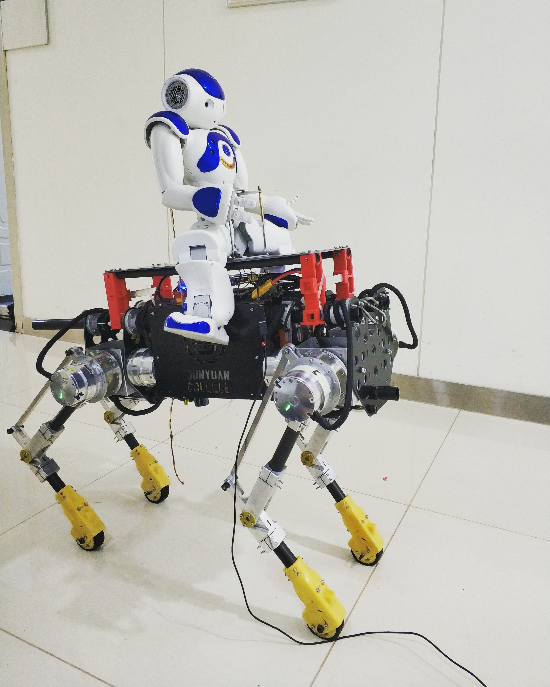

# JNU-Quadruped-Robot-New-Host

This is the host source code of jiangnan university 12 degrees of freedom quadrued robot project.

This program can run on Raspbian(raspberry PI) or Ubuntu(PC). This program communicates with slave program which runs on micro-controller with USB-uart.
> Slave program: https://github.com/senhoi/JNU-Quadruped-Robot-Prog-Slave

